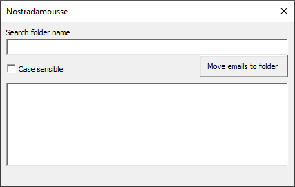

# Nostradamousse
Small Outlook VBA program to move selected emails in a subfolder via a userform with incremental search.

## Main features

* Incremental search subfolders
* Optional case sensible search
* Autoselect on unique folder result

# How to use it ?

Your need to insert the macro code and create the userform in Outlook.

## Macro code insertion

Just insert code in your Outlook macro. (you need access the VBA editor of Outlook)

1. Create a userform with name **NostradamousseForm** and a module **NostradamousseModule**
2. In NostradamousseForm, copy/paste all code from the file NostradamousseForm.outlook.vba
3. In NostradamousseModule, copy/paste all code from the file NostradamousseModule.outlook.vba

And you can execute Nostradamousse via Outlook macro

## Userform creation and input

You can create the design of the userform you wish, the size, the color and anything else you want. You just need use the defined name for all inputs. Please respected the case.

* Search bar textbox : searchbox
* Checkbox of the case sensible : chkCaseSensible
* Move email to folder submit button : btMoveToFolder
* Folder list input : folderList

